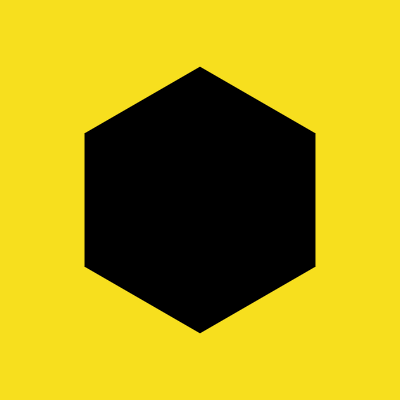

# canvas-polygon

> Create polygons with the Canvas API

## Installation

```sh
yarn add canvas-polygon
```

## API

This module exports a single function:

```js
function polygon (ctx, x, y, radius, sides, startAngle, counterClockwise) { }
```

It takes the following arguments:

- `ctx` - a canvas context object
- `x` - a Number
- `y` - a Number
- `radius` - a Number
- `sides` - a Number greater than 2. :)
- `startAngle` - a Number in radians. `Math.PI` is 180 degrees. Defaults to `0`
- `counterClockwise` - a Boolean. Defaults to `false`


## Example

```js
const polygon = require('.')
const yellow = require('javascript-yellow')
const canvasSize = 400

window.addEventListener('DOMContentLoaded', draw)

function draw () {
  var canvas = document.createElement('canvas')
  var ctx = canvas.getContext('2d')
  document.body.appendChild(canvas)
  canvas.width = canvasSize
  canvas.height = canvasSize
  ctx.fillStyle = yellow
  ctx.fillRect(0, 0, canvasSize, canvasSize)
  ctx.fillStyle = '#000'
  polygon(ctx, canvasSize/2, canvasSize/2, canvasSize/3, 6, Math.PI/2)
}
```

To see this in your browser:

```sh
yarn && yarn demo
```

Then open [localhost:9966](http://localhost:9966/)

You should see this:



## Tests

```sh
npm install
npm test
```

## Dependencies

None

## Dev Dependencies

- [budo](https://github.com/mattdesl/budo): a browserify server for rapid prototyping
- [javascript-yellow](): The official color of the JavaScript logo
- [standard](https://github.com/feross/standard): JavaScript Standard Style
- [standard-markdown](): Test your Markdown files for Standard JavaScript Style™


## License

MIT
